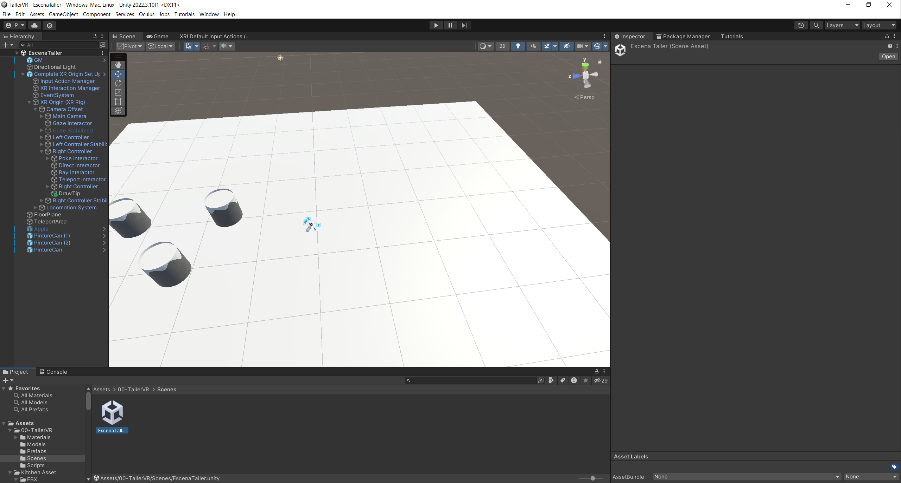
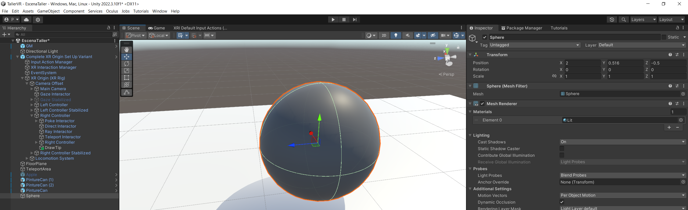
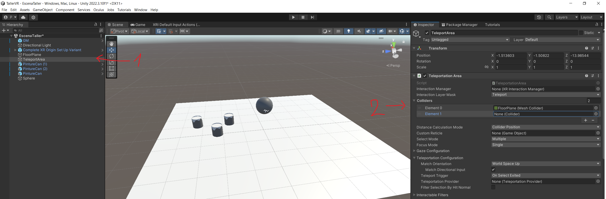

# Taller de Realitat Virtual i Augmentada
En aquest repositori podeu trobareu la pràctica per a fer durant el taller.

La idea és poder fer, en Realitat Virtual, un petit sistema per a poder dibuixar en 3D. Com que no hi ha ulleres per a tothom, el projecte inclou el [Meta XR Simulator](https://developer.oculus.com/documentation/unity/xrsim-intro/). Podeu usar-lo per a testejar-lo, i un cop ja ho tingueu, ho exporteu per a provar en les ulleres físiques.

## Índex

- [El simulador](#simulator)
- [Instruccions](#instruccions)
    1. [Creació de l'escena](#crear_escena)
    2. [Crear objectes que es puguin agafar](#grabbable)
    3. [Script per dibuixar a l'aire](#draw)
    4. [(OPCIONAL) Poder agafar el dibuix](#grab_draw)
    5. [(OPCIONAL) Escollir el color del dibuix](#color)

## El simulador <a class="anchor" id="simulator"></a>

## Instruccions <a class="anchor" id="instruccions"></a>
La idea és poder usar aquest projecte per a introdur-se una mica amb Unity i el desenvolupament per a RV.

Teniu en compte que dins de l'editor treballarem amb el material de dins de la carpeta [Assets/00-TallerVR/](./TallerVR/Assets/00-TallerVR/)

### Creació de l'escena <a class="anchor" id="crear_escena"></a>
1. Obriu Unity, i carregueu l'escena "EscenaTaller" de la carpeta [Scenes](./TallerVR/Assets/00-TallerVR/Scenes/).



2. Activa el simulador. (A les pestanyes de dalt, anar a `Oculus > Meta XR Simulator > Activate`)

3. Aneu a la carpeta de [Models](./TallerVR/Assets/00-TallerVR/Models/) i arrestreu-ne uns quants a la vostra escena. Podeu moure'l usant les fletxes que hi apareixen a sobre, o a partir de l'inspector (la pestanya del costat dret). Per rotar i escalar, podeu canviar la eina a ma esquerra, o també des de l'inspector. Per seleccionar un objecte, podeu fer-ho des de la jerarquia (pestanya esquerra), o des de la mateixa escena.

Hi ha un pla de base, però podeu afegir més terreny o caviar-lo si voleu.



4. Ara mateix no us podreu moure en VR. Per a fer-ho, heu de indicar al programa quines són les zones on us voleu poder teletransportar. Per això, seleccioneu l'objecte `TeleportArea` des de la jerarquia, busqueu el component `Teleportation Area`, desplegueu la opció de `Colliders`, i afegiu allà els "terres" per on us voleu moure (fent click al "+", i arrastrant un objecte de la jerarqua cap al nou lloc.)



5. Premeu al "Play", i proveu de moure-us en el simulador usant la teletransportació.

### Crear objectes que es puguin agafar <a class="anchor" id="grabbable"></a>
Per poder agafar un objecte, es necessita:
- Detectar si un objecte ha col·lisionat amb la mà
- Mirar si l'objecte amb que s'ha xocat es pot agafar (segurament no voldras que el jugador agafi el terra o la paret i ho mogui de lloc)
- Un script per a poder moure l'objecte amb la ma

He deixat preparats 2 components per a fer aquesta detecció, que són [GrabObjects](./TallerVR/Assets/00-TallerVR/Scripts/GrabObjects.cs) (script per a posar a una font i fer que pugui afagar objectes) i [Grabbable](./TallerVR/Assets/00-TallerVR/Scripts/Grabbable.cs) (script que tindran els objectes que es poden agafar, i té el comportament de com es mouen). Ambdós estan dins la carpeta de [Scripts](./TallerVR/Assets/00-TallerVR/Scripts/). 

El component de GrabObjects ja està incorporat en el jugador, així que no fa falta fer-li res. Ja té la seva part corresponent també de detecció de col·lisions.

Anem a fer que es pugui agafar algun objecte:
1. Seleccioneu algun dels models que heu afegit nous.
2. Afegiu-li un component de `BoxCollider`. (Aneu a l'inspector, a la part final, seleccioneu `Add Component`, i busqueu el que us interessi.) En principi ja s'adaptarà sol a les dimensions de la malla del model. Sempre el podeu modificar amb les opcións que té el component.
3. Afegu-li un component de `Rigidbody`. Aquest component permet simular físiques. Si no voleu que l'objecte es vegi afectat per la física, marqueu com a cert el bool de `IsKinematic`. Si el deixeu desmarcat, l'objecte es veurà afectat per la gravetat i col·lisions.
4. Afegiu-li un component de `Grabbable`.
5. Premeu "Play", i proveu amb el simulador d'agafar l'objecte.

Afegiu si voleu aquests components a altres objectes que hagueu afegit. Podeu cambiar el `BoxCollider` per d'altres, com una esfera, una càpsula, o una col·lisió de malla (no recomanable, és més ineficient).


### Script per dibuixar a l'aire <a class="anchor" id="draw"></a>
Aquesta part de la pràctica consisteix en que completeu un component que us permeti dibuixar a l'aire. Per això, crearem un nou objecte per cada traç que fem, i farem que segueixi a la ma.

1. Obre el script de [AirDraw.cs](./TallerVR/Assets/00-TallerVR/Scripts/AirDraw.cs).
2. Completa la funció `StartDrawingLine`:
    - Crea un nou objecte i guarda'l a la variable `drawing`. Canvia la transformada de posició perquè estigui en la mateixa posició que l'objecte que té aquest component (pots usar el `this` per accedir-hi). Pot ser útil la documentació del component [Transform](https://docs.unity3d.com/ScriptReference/Transform.html).
    - Afegeix-li un component de `TrailRenderer`. (Aquest component deixa una traça a mesura que es va movent, i es va esborrant amb el temps. Per decidir la traça, es va guardant els punts del recorregut, i pinta una línea entre els punts.)
    - Modifica les propietats de la traça perquè estigui present un temps llarg (per exemple 100000 segons), la seva amplada es multipliqui per 0.015, i com a material tingui una nova instància del `BaseMaterial`. Pots usar la documentació de les classes [TrailRenderer](https://docs.unity3d.com/ScriptReference/TrailRenderer.html) i [Material](https://docs.unity3d.com/ScriptReference/Material.html).
    - Fes que `this` sigui el pare del nou objecte. Mira de nou la documentació del component [Transform](https://docs.unity3d.com/ScriptReference/Transform.html).

Com he dit, aques component desfà el dibuix passat un temps, així que el Game Manager l'agafarà un cop acabat el traç, i crearà un objecte sense límit de vida amb el traç realitzat. Podeu veure el codi de com es fa en el [Game Manager](./TallerVR/Assets/00-TallerVR/Scripts/GameManager.cs). 

### (OPCIONAL) Poder agafar el dibuix <a class="anchor" id="grab_draw"></a>
Si t'interessa poder agafar els diversos dibuixos i moure'ls per l'espai, serà necessari que facis el següent:

Obre el script del [GameManager](./TallerVR/Assets/00-TallerVR/Scripts/GameManager.cs), busca la funció `MakeDrawingStatic`, i modifica'n la part final perquè es pugui agafar. Endevines quins són els 3 components que has d'afegir?

<details>
  <summary>[SPOILER] - Component 1</summary>

> BoxColldier

</details>

<details>
  <summary>[SPOILER] - Component 2</summary>

> RigidBody

(si vols que NO li afecti la gravetat, posar a true la variable `isKinematic`)

</details>

<details>
  <summary>[SPOILER] - Component 3</summary>

> Grabbable

</details>


### (OPCIONAL) Escollir el color del dibuix <a class="anchor" id="color"></a>
Fins ara heu estat pintatn en negre. Per canviar el col·lor del traç, us he deixat preparat un sistema: haureu de col·locar els pots de pintura per l'escena, triar-ne el seu color, i quan fiqueu la ma al pot de pintura, les següent traces seràn del nou color.

1. Aneu a la carpeta de [Prefabs](./TallerVR/Assets/00-TallerVR/Prefabs/) i arrastreu a la escena algun `PintureCan`.
2. Busqueu el seu component de `PaintInfo`, i escolliu-ne el color que volgueu per cada pot.
3. Obriu el script [AirDraw.cs](./TallerVR/Assets/00-TallerVR/Scripts/AirDraw.cs).
4. Aneu a la funció de `OnTriggerEnter`, i afegiu el codi per detectar si heu tocat un pot de pintura. Podeu detectar si ho és mirant si té el component `PintureInfo`. (L'element amb què heu col·lisionat és el `other`).

<details>
  <summary>[SPOILER] - Detecció de col·lisió amb el pot</summary>

```c#
void OnTriggerEnter(Collider other)
    {
        PaintInfo info = other.GetComponent<PaintInfo>();
        if (info != null)
        {
            // ...
        }
    }
```

</details>

5. En cas de que l'element detectat sigui un pot de pintura, agafa'n el color. Pots mirar el codi del component [PaintInfo](./TallerVR/Assets/00-TallerVR/Scripts/PaintInfo.cs) per saber com aconseguir el material de la pintura.

